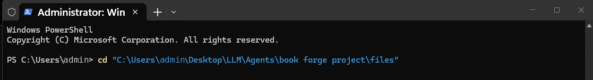
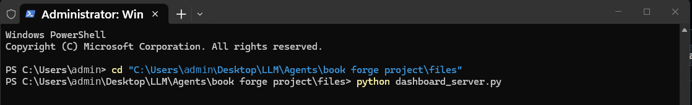
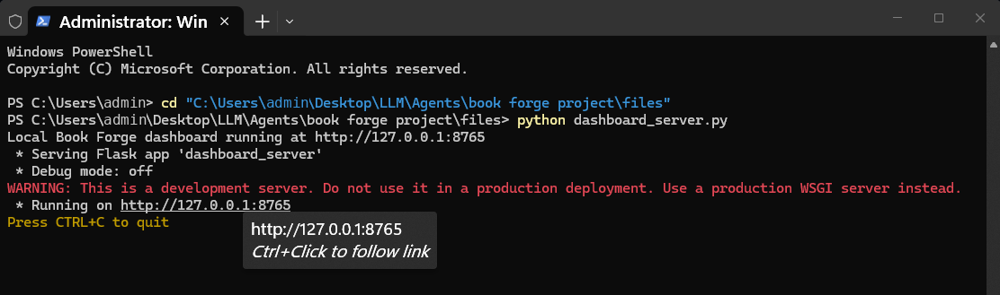
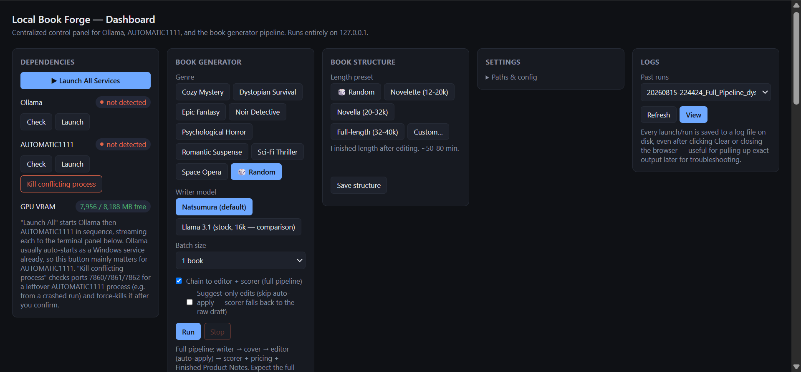
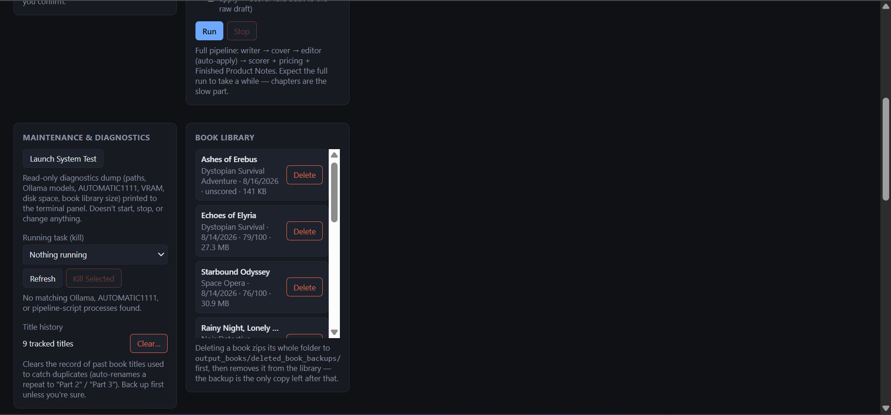
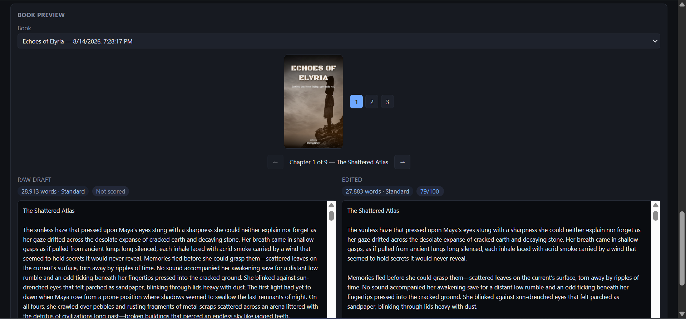
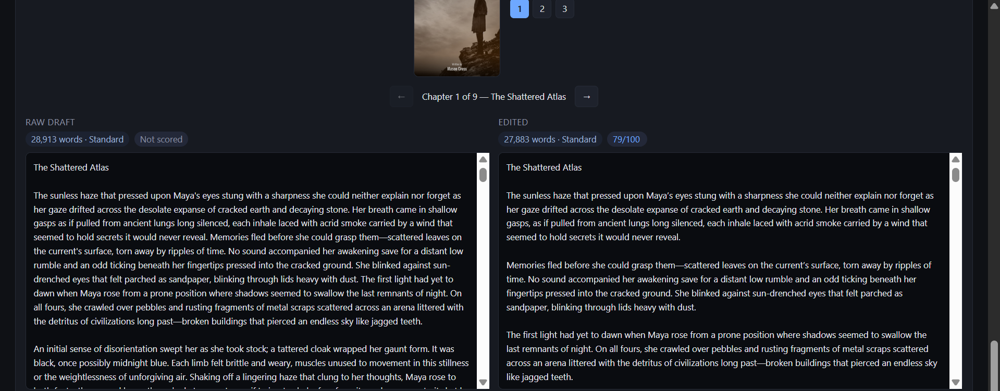
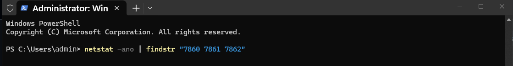
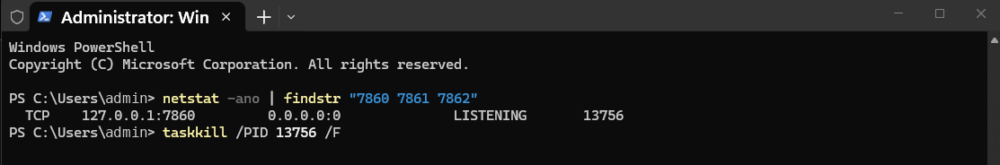
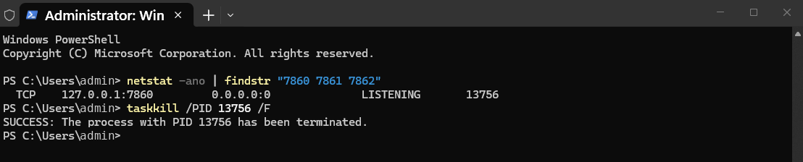

# Local Book Forge

A fully local, self-hosted pipeline that generates original genre fiction
end to end — outline, chapters, cover art, an editorial pass, a quality score
and a formatted manuscript — with no cloud API calls, no API keys and no
per-token cost. It runs on a single laptop with an 8GB RTX 4060.

```
outline → chapters → cover art → editorial pass → quality score → manuscript
 CrewAI    Ollama      SDXL         Ollama        deterministic     .docx
          (direct)   (A1111)       (direct)        + LLM
```

Everything runs on `127.0.0.1`. The two heavy dependencies — a language model
server and an image model server — are spoken to over plain HTTP, so there is
no vendor SDK anywhere in the tree and nothing leaves the machine.

## Why this exists

I read a lot, and this started as a way to scratch that itch from the other
side: if I like a particular flavour of genre fiction, could I get a machine
sitting on my own desk to produce something in that vein, end to end, without
renting anyone's API? That is the whole motivation. It is a personal hobby
project — an excuse to learn how far local models have actually come and to
have fun with the pipeline engineering — not a product, not a business, and
not built to publish or sell anything.

The interesting part turned out to be the engineering rather than the books:
keeping a 16k-context model coherent across 30,000 words, catching a model
that has started narrating instead of writing, and fitting a writer, an
editor, a scorer and an image model through 8GB of VRAM one at a time.

---

**Contents**

- [Why this exists](#why-this-exists)
- [What it looks like](#what-it-looks-like) — dashboard walkthrough
- [Dependencies](#dependencies)
- [Setup](#setup)
- [How to use it](#how-to-use-it)
- [What a run produces](#what-a-run-produces)
- [Engineering notes](#engineering-notes) — the problems that were actually hard
- [Repository layout](#repository-layout)

---

## What it looks like

The pipeline can be driven entirely from the command line, but the normal way
to use it is the browser dashboard — a Flask app with server-sent events that
streams every stage's output live.

### 1. Start the dashboard

Open a terminal in the repository and change into it:



Start the server:



It binds to `127.0.0.1:8765` and prints the URL to open:



### 2. Configure and launch a run

The control panel is one page. Left to right: dependency health with a
one-click launcher and live VRAM readout, the generator itself (genre, writer
model, batch size, whether to chain the editor and scorer), the length preset,
and the log archive for past runs.



Genre can be pinned or randomised per run, and the writer model can be
switched between the fine-tuned storytelling model and a stock Llama 3.1 build
for side-by-side comparison. `Chain to editor + scorer` runs the whole pipeline
unattended; unchecked, it stops at the raw draft.

### 3. Watch it, then browse the library

Finished books appear in the library with their genre, date, score and size,
and can be removed from the UI — deletion zips the book's folder to a backup
directory first. The maintenance panel is a read-only diagnostics dump plus a
kill switch for a stuck job.



### 4. Inspect the output

The book preview renders the generated cover, the chapter list and the score,
with the raw draft and the edited version side by side:



That side-by-side is the fastest way to see the editorial agent working. In the
excerpt below, the raw draft's long narration block is broken into shorter
paragraphs and tightened — the same transformation the score is measuring:



Full panel-by-panel reference for the dashboard: [docs/dashboard.md](docs/dashboard.md).

### Troubleshooting: a stuck image-model process

The image model holds VRAM the language model needs, so a crashed run can leave
a process squatting on the port. The dashboard has a button for this; the
manual equivalent is to find the listener:



...and terminate it by PID:





---

## Dependencies

### Runtime services

Both run locally and are called over HTTP. Neither is vendored here.

| service | purpose | default endpoint |
|---|---|---|
| [Ollama](https://ollama.com) | language model inference — outline, chapters, editorial pass, LLM-rated metrics | `http://localhost:11434` |
| [AUTOMATIC1111 WebUI](https://github.com/AUTOMATIC1111/stable-diffusion-webui) | SDXL cover art generation | `http://127.0.0.1:7860` |

You also need an SDXL checkpoint installed in AUTOMATIC1111, and the two
16k-context model tags built from the `Modelfile`s in `models/` (below).

### Python packages

```
crewai>=0.28       agent orchestration for the outline and analysis passes
requests>=2.31     direct Ollama / AUTOMATIC1111 HTTP calls
python-docx>=1.1   .docx manuscript assembly
Pillow>=10.0       cover composition and text overlay
Flask>=3.0         dashboard server (SSE job streaming)
```

There is deliberately no LLM or image-generation SDK in this list.

### Hardware

Developed on an RTX 4060 Laptop GPU (8GB VRAM), 32GB system RAM, Windows 11.
The VRAM ceiling shapes the design: the image model and the language model
cannot be resident at the same time, so stage transitions explicitly unload
checkpoints and wait for VRAM to free rather than assuming it. On a card with
more headroom several of those guards become unnecessary — but the failure
they prevent is worth knowing about on any constrained setup, and it is
[documented here](docs/vram-and-local-inference.md).

A full pipeline run (write → cover → edit → score) takes roughly 35–50 minutes
on that hardware for a 20–30k-word book. Chapter generation is the slow part.

---

## Setup

```bash
git clone <this-repo>
cd local-book-forge
pip install -r requirements.txt
```

Build the two custom model tags. These are local `ollama create` builds — the
Modelfiles set a 16k context window and the system prompts, and are committed
here rather than pulled from a registry:

```bash
ollama create llama3.1-16k -f models/Modelfile.llama31-16k
ollama create writer-16k   -f models/Modelfile.writer-16k
```

Copy the example config and point it at your machine:

```bash
cp config/dashboard_config.example.json config/dashboard_config.json
```

`dashboard_config.json` holds absolute local paths (your Python executable, the
repo, your AUTOMATIC1111 launch script) and is gitignored for that reason. It
also carries the default book-structure preset:

```json
{
  "python_exe": "C:\\path\\to\\python.exe",
  "script_path": "C:\\path\\to\\repo\\src\\local-book-generator.py",
  "a1111_bat_path": "C:\\path\\to\\stable-diffusion-webui\\webui-user.bat",
  "ollama_url": "http://localhost:11434",
  "a1111_url": "http://127.0.0.1:7860",
  "book_structure_preset": "novella"
}
```

Start Ollama and AUTOMATIC1111 (the dashboard's **Launch All Services** button
does both in sequence, streaming each to the terminal panel).

---

## How to use it

### From the dashboard

```bash
python src/dashboard_server.py     # → http://127.0.0.1:8765
```

Pick a genre and a length preset, tick `Chain to editor + scorer`, press
**Run**. Output streams to the terminal panel and the finished book appears in
the library.

### From the command line

Full chain, one or more books back to back:

```bash
python src/pipeline_chain.py
```

Individual stages, each of which runs standalone against a book folder:

```bash
python src/local-book-generator.py --genre "noir detective" --chapters 10
python src/editorial_agent.py     --book-dir output_books/<book>
python src/scoring_agent.py       --book-dir output_books/<book>
python src/repolish_agent.py      --book-dir output_books/<book>
```

Stage independence is load-bearing rather than cosmetic: a failed scoring run
is re-run without regenerating the book, and the editorial pass can be pointed
at any existing draft.

Housekeeping:

```bash
python src/project_cleanup.py            # dry run by default
python src/project_cleanup.py --apply
```

---

## What a run produces

Each book gets its own folder:

```
output_books/<timestamp>_<title>/
  outline.json              chapter beats, characters, per-chapter word targets
  chapter_01.txt ...        raw draft, one file per chapter
  cover.png / cover.jpg     selected cover (plus the candidates it beat)
  manuscript.docx           formatted manuscript
  editorial_review.txt      every issue found, by category and severity
  style_sheet.json          continuity facts accumulated across chapters
  edited/                   post-editorial chapters, with their own score + docx
  book_score.json           all 18 sub-metrics
  book_score_report.txt     human-readable score with the reasoning for each
```

The `edited/` subfolder mirrors the book rather than overwriting it, so the raw
draft and the edited version can be scored and compared independently. That
comparison is how most of the findings below were made.

A complete run is committed under [`samples/`](samples/) so the output format
is inspectable without running anything.

---

## Engineering notes

The interesting part of this project is not that it generates books. It is what
breaks when you run generative models on constrained local hardware for hours
at a time, and how you find out. Six findings, condensed — each links to the
full write-up.

**1 · A quality metric that couldn't see catastrophic failure.** A book scored
80/100 while being unreadable: one word was 12.4% of the text and the
type-token ratio over a 400-word window was 0.055. None of the 18 sub-metrics
caught it, because readability scores *improve* on looping prose. The fix was a
dedicated detector — sliding-window type-token ratio plus a single-word
frequency ceiling, calibrated against 19 real chapters (5/5 known-bad, 0/14
known-good) — applied as a **score ceiling** rather than a 19th averaged
metric. Averaging a catastrophic failure against 17 healthy metrics is exactly
how the 80/100 happened. A later finding hardened it further: the detector was
phase-dependent, and a four-word offset flipped its verdict, so it now scans at
four independent phase offsets. → [docs/quality-scoring.md](docs/quality-scoring.md)

**2 · Silent CPU offload masquerading as three unrelated bugs.** The machine
crashed during batch runs, the editorial pass hung, and a "rogue" model process
ate half the CPU and RAM and respawned after being killed. One root cause:
nothing unloaded the SDXL checkpoint before the language model loaded, so with
both resident in 8GB of VRAM the LLM server **silently fell back to CPU
inference rather than erroring**. That is the failure mode worth knowing about
— it doesn't announce itself, it just gets slow and eats the box.

| | before | after |
|---|---|---|
| chapter write time | 128–899s, erratic | 108–183s, tight |
| full pipeline | 45–63 min | 33.8 min |

→ [docs/vram-and-local-inference.md](docs/vram-and-local-inference.md)

**3 · The orchestration framework was silently dropping a parameter.**
CrewAI/litellm drops `max_tokens` for Ollama models. Proven twice, in both
directions: a chapter capped at 2,730 words came back at 8,759, and on the
revision side the same defect truncated long rewrites which the length check
then rejected as "too short". Chapter writing and revision now call
`/api/chat` directly with an explicit options dict; the analysis passes still
use CrewAI, where its JSON retry handling earns its place. Caught by standing
up a mock HTTP server and reading the request body — verify what your
abstraction layer actually sends. → [docs/architecture.md](docs/architecture.md)

**4 · A style ratchet hiding in the continuity mechanism.** Sentence length
swung from 26 to 55 words between chapters of the same book. The tell:
chapter 1 is the only chapter that receives no continuity seed, and it was the
only consistent one (26.5 mean, stdev 1.7, against 31.8 / stdev 7.9 for the
rest). Correlating each chapter against the one before it, centred within book,
with a permutation test because n is small:

| predictor | r | p |
|---|---|---|
| previous chapter's **tail** (the 1,500 chars pasted into the prompt) | **+0.42** | **0.012** |
| previous chapter's **body** (its overall style) | +0.18 | 0.27 |

What gets pasted predicts the next chapter; what doesn't get pasted doesn't.
The model imitates the sample, and since the sample is last in the prompt it
outranks the abstract instruction earlier — a ratchet with no restoring force.
→ [docs/continuity-seed-style-ratchet.md](docs/continuity-seed-style-ratchet.md)

**5 · A guard that caused the defect it was meant to prevent.** The editorial
pass rejected revisions under 50% of the original length — but a real revision
from this editor condenses to 51–65%, so the threshold sat on top of the
distribution and acceptance was close to a coin flip. Two chapters were
rejected three times each and shipped unedited, and were then the worst prose
in the book. The counter-intuitive part: chapters that *failed* the check and
fell through to salvage measured **better** than the ones that passed (FK 10.9
vs 13.1, dialogue 14.1% vs 3.8%). The length floor was fighting the style
directives — told its revision came back short, the model complied the safe way
and pasted the original dense narration back in. The prompt now asks it to
reach the word count by dramatising narration into dialogue, and revision
selection keeps the best-scoring valid attempt rather than the first one that
fits. → [docs/editor-best-of-n.md](docs/editor-best-of-n.md)

**6 · Measuring the wrong text.** The editor reported 2–10% dialogue per
chapter; the scorer reported 24.6% for the same book, using an identical regex.
The writer emits mixed quote characters, and with straight quotes one character
serves as both delimiters — so a single unbalanced quote inverts the
alternation and every subsequent match captures *the narration between* the
dialogue. Same chapter, same regex: 39.5% measured after typography
normalisation, 4.8% measured before it. Both components now normalise through
the same function before measuring, verified identical to four decimal places
across 53 real chapters. **Two components measuring "the same thing" on
slightly different inputs is a bug class, not an incident.**
→ [docs/editor-best-of-n.md](docs/editor-best-of-n.md)

### Design decisions worth defending

**Deterministic metrics wherever possible.** Of the 18 scoring sub-metrics,
most are computed rather than asked. An LLM-rated "emotional resonance" metric
was retired after it scored deliberately quiet chapters at 90+ — a saturated
rater correlating near zero with the outline's own intent. Its replacement, a
pacing index built from sentence length, paragraph length and dialogue share,
correlates +0.65 with planned intent on the same book.

**Style instructions live in the editor, not the writer.** Measured: the writer
ignores them (told to write short sentences, produced a 26-word average with a
112-word outlier); the editor acts on them (readability 46 → 81 in one run).

**Failure modes get different retry budgets.** A refusal costs a sentence to
retry, so it gets five attempts. A repetition collapse costs a full-length
generation, so it gets two — and only after the *seed* is checked, because
rerolling cannot escape a poisoned seed.

**Constants carry their evidence.** Thresholds in this codebase are commented
with the measurements that set them and, where relevant, the history of the
values that were wrong. `REVISION_SALVAGE_RATIO` documents two previously
incorrect values and why a third guess wasn't the fix. Every one of those
numbers was wrong at least once, and the comment is what stops it being
re-broken.

---

## Repository layout

| path | role |
|---|---|
| `src/local-book-generator.py` | Stages A–D: outline generation and JSON repair, chapter writing with streaming collapse detection, SDXL cover generation, manuscript assembly |
| `src/editorial_agent.py` | Macro/style/micro review in one combined pass, then auto-applied revision with best-of-N selection |
| `src/scoring_agent.py` | 18 sub-metrics across 6 categories, mostly deterministic |
| `src/repolish_agent.py` | Targeted re-run that feeds the scorer's own notes back in |
| `src/pipeline_chain.py` | Chains the stages with cooldowns between books |
| `src/dashboard_server.py`, `src/dashboard.html` | Flask + SSE control panel — job streaming, book preview, structure presets |
| `src/project_cleanup.py` | Dry-run-by-default purge that preserves reference books |
| `models/` | Modelfiles for the two 16k-context local model builds |
| `config/` | Example dashboard config |
| `docs/` | Architecture and the long-form engineering write-ups |
| `samples/` | One complete run, committed as a reference artifact |

---

## Status

A hobby project, developed on and off for fun. Books produced by the current
pipeline score 74–82/100 on the internal rubric. Known open issue: readability sits below target on longer
books (Flesch-Kincaid ~15 against a 6–9 goal) — the continuity-seed fix above
is the most recent attempt at it and has not yet been validated on a full run.

Text and cover art produced by this pipeline are machine-generated. Anything
published from it should be disclosed as such wherever the destination
platform asks.
